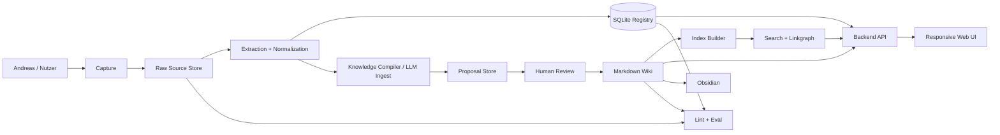

# Architecture Requirements Dossier (ARD)

**Status:** v0.1 — Initial Baseline
**Stand:** 2026-05-08
**Letzte Architektur-Entscheidungen:** [adr/](adr/)

Dieses Dokument ist die **Architekturwahrheit** des Projekts. Bei Konflikt mit anderen Dokumenten gilt das ARD oder das einschlägige ADR. Änderungen am ARD erfordern ein begleitendes ADR.

---

## 1. Mission

Das Curiosity Wiki ist ein **persönlicher, quellengestützter Wissenskompiler**, der Rohquellen archiviert, mit LLM-Hilfe zu lesbaren Wiki-Seiten verdichtet, und Wiederentdeckung über Suche, Browse, Sammlungen und Zufall ermöglicht.

Es ist explizit:

- **Kein** Chatbot mit Speicher.
- **Kein** reines RAG-System.
- **Kein** öffentliches Wiki.
- **Kein** autonomer Webcrawler.

Es ist:

- Ein **Knowledge-Compiler** mit Review-Schleife.
- Ein **versionierter Wissensgarten** für eine Person.
- Ein **lokaler-zuerst** System, das später kontrolliert read-only veröffentlicht wird.

## 2. Stakeholder

| Rolle | Person | Verantwortung |
|---|---|---|
| Owner | Andreas Keis | Produkt, Inhalte, Reviews, Releases, Source Policy |
| Engineering Assistant | Claude / ChatGPT | Architektur, Code-Vorschläge, Doku, Risikoanalyse |
| Konsumenten | Andreas + ggf. einzelne Vertraute | Lesen, Browsen am Laptop und Smartphone |

## 3. Kontext



## 4. Layer-Modell

Strikt von oben nach unten. Höhere Schichten schreiben nicht direkt in tiefere.

```text
[1] Capture Adapters
    Browser, Webclipper, Datei-Drop, manuelle Notiz, CSV/JSON-Import, Chat-Auszug
        ↓
[2] Raw Source Store         (raw/)
    unveränderte Snapshots, Manifest, SHA-256, Source Policy Metadaten
        ↓
[3] Extraction & Normalization  (extracted/)
    HTML/PDF/DOCX/CSV/Text → extracted.md + metadata.yaml
        ↓
[4] Registry / Meta Layer    (data/registry/curiosity.sqlite)
    sources, source_snapshots, extractions, pages, claims, proposals,
    ingest_runs, lint_runs, lint_findings, freshness_tasks, quarantine_cases,
    agent_prompts, agent_runs, search_index_runs
        ↓
[5] Knowledge Compiler / LLM Proposal  (proposals/)
    proposal.yaml, summary.md, patch.diff, new_pages/, updated_pages/, risk_notes.md
        ↓
[6] Human Review
    accept | reject | request-changes | quarantine | split | merge
        ↓
[7] Published Wiki  (wiki/)
    Markdown-Seiten mit Frontmatter, Source Pages, Collections, Methods, Recipes
        ↓
[8] Read Models  (read_models/)
    site_index.json, graph.json, search_documents.jsonl, freshness_dashboard.json,
    page_cards.json, mobile_nav.json, source_trust_dashboard.json, open_questions.json
        ↓
[9] UI / Query / Browse
    Obsidian, CLI, FastAPI + Jinja2-Web-Frontend, später optional htmx
```

**Architekturregeln:**

- UI liest aus `wiki/` und `read_models/`, niemals direkt aus `raw/`.
- Agenten schreiben nur nach `proposals/`, niemals direkt nach `wiki/`.
- Raw Sources werden nie überschrieben.
- Read Models sind rebuildbar.
- Registry hält operative Zustände.

## 5. Persistenz

| Speicher | Inhalt | Wahrheit |
|---|---|---|
| `raw/` | Immutable Source-Snapshots | Source-Wahrheit |
| `extracted/` | Extrahierter Text + Metadaten | Regenerierbar aus Raw |
| `wiki/` | Markdown mit YAML-Frontmatter | Synthese-Wahrheit |
| `data/registry/curiosity.sqlite` | Operative Zustände, Jobs, Provenienz | Operative Wahrheit |
| `proposals/` | LLM-Proposals und Diffs | Tranche-Wahrheit |
| `read_models/` | UI-optimierte Darstellungen | Generiert, rebuildbar |

**Markdown-first, aber nicht Markdown-only:** Markdown ist die menschenlesbare Wissensebene; SQLite ist das operative Gedächtnis des Systems.

## 6. Stabile IDs

Jedes relevante Objekt bekommt eine stabile ID:

| Objekt | Format-Beispiel |
|---|---|
| Source | `src_20260505_143012_7K3P` |
| Page | `page_01HX9W2M6YK7K8E6J4N2Z7T1QK` |
| Claim | `clm_01HX9W3H7S3A9D2M8Q8J1N5A2P` |
| Proposal | `prop_20260505_150211_ingest_src_...` |
| Run | `run_20260507_184512_ab12` |
| Job | `job_01HX9W4T...` |

Pfade bleiben menschenlesbar, IDs bleiben stabil. Pfad-Umzüge brechen keine Verlinkung.

## 7. Datenmodell-Kurzform

### Source Manifest (Pflicht)

`id`, `title`, `source_type`, `original_url`, `captured_at`, `raw_path`, `extracted_path`, `sha256`, `language`, `access`, `copyright_risk`, `reliability`, `llm_allowed`, `status`, `why_interesting`, `related_pages`.

### Page Frontmatter (Pflicht)

`id`, `title`, `slug`, `type`, `status`, `created`, `updated`, `freshness`, `last_checked`, `review_after`, `confidence`, `source_policy`, `sources`, `tags`, `aliases`, `why_interesting`, `llm_generated`, `human_reviewed`, `reviewed_at`, `schema_version`.

### Seitentypen

`source`, `topic`, `person`, `place`, `event`, `product_research`, `recipe`, `method`, `experiment`, `collection`, `question`, `work`, `brand`.

Vollständige Templates: in M3 als Teil von `wiki/_meta/templates/`.

## 8. Runtime

### Lokal (Dev-Laptop)

- Python 3.11+ als CLI und Backend.
- SQLite als Registry.
- Markdown im Filesystem.
- Optional Obsidian als Lese-/Edit-Werkzeug.
- LLM-Calls nur explizit, mit Mock-Default.
- Web-UI lokal auf 127.0.0.1 (ab M5).

### VPS (Windows VPS, ab M6)

- Read-only Webdienst.
- Cloudflare Tunnel für öffentlichen Zugang.
- Tailscale für Admin-Zugang.
- Windows-Service oder WinSW-Wrapper für Persistenz.
- Backup-Task via Scheduled Task.
- Keine LLM-Calls vom VPS aus im MVP.
- Keine produktiven Schreibrechte für Agenten im MVP.

## 9. Schnittstellen

### CLI (curiosity)

Geplante Top-Level-Commands (über alle Phasen):

```text
curiosity init                    # T0.1
curiosity paths                   # T0.1
curiosity registry init           # M1
curiosity registry check          # M1
curiosity capture url <URL>       # M1
curiosity capture file <PATH>     # M1
curiosity capture note <TEXT>     # M1
curiosity sources list            # M1
curiosity sources show <id>       # M1
curiosity extract <source_id>     # M2
curiosity ingest <source_id>      # M2
curiosity proposal list           # M3
curiosity proposal show <id>      # M3
curiosity proposal approve <id>   # M3
curiosity proposal reject <id>    # M3
curiosity search "<query>"        # M4
curiosity browse --random         # M4
curiosity browse --topic <name>   # M4
curiosity lint                    # M4
curiosity eval golden             # M4
curiosity rebuild-read-models     # M5
curiosity health-check            # M5
curiosity quality-gates           # alle Phasen
```

### Web API (ab M5)

```text
GET  /api/health
GET  /api/health/deep
GET  /api/pages
GET  /api/pages/{id_or_slug}
GET  /api/pages/{id}/backlinks
GET  /api/sources
GET  /api/sources/{id}
GET  /api/proposals          (read-only im MVP)
GET  /api/proposals/{id}
GET  /api/search?q=...
GET  /api/browse/random-walk
GET  /api/browse/topic/{name}
GET  /api/lint/report/latest
```

Schreibe-Endpunkte (POST/PUT/DELETE) sind im MVP **nicht** auf dem VPS exponiert.

## 10. Sicherheit

| Bedrohung | Gegenmaßnahme |
|---|---|
| Prompt Injection in Quellen | Quellen sind untrusted; Agenten ignorieren Anweisungen aus Quellen |
| Secret Leak | `.env` in `.gitignore`; Secret Scan in Quality Gates |
| Private Raw Sources im Public Repo | `raw/**/*` in `.gitignore`; nur READMEs werden committed |
| Unkontrolliertes Schreiben durch Agent | Proposal-Only-Pattern, atomic write nach Review |
| Ungewollter Public-VPS-Zugriff | Cloudflare Tunnel, Tailscale-Admin, Firewall closed unless intentional |
| LLM-Halluzination | Claim-Marker, Quellenbindung, Golden Tests, Confidence-Levels |
| Copyright/Paywall | Source Policy, kein Volltext-Speichern paywalled Inhalte |

Vollständig: [SECURITY.md](SECURITY.md), [SOURCE_POLICY.md](SOURCE_POLICY.md).

## 11. Observability

| Zweck | Mechanismus |
|---|---|
| Prozess lebt | `/healthz` Liveness |
| Tiefe Health | `/healthz/deep`: Registry, Wiki Path, Read Models, optional LLM Config |
| Fehler-Logs | `logs/app.log`, `logs/jobs.log`, `logs/ingest.log`, `logs/deploy.log`, `logs/backup.log` |
| LLM-Kosten | `ingest_runs` mit `token_usage_json` |
| Lint-Status | `docs/_ops/lint_reports/` |
| Run Evidence | `ingest_runs` mit `prompt_id`, `prompt_hash`, `model`, `parameters` |
| Quality Gate Logs | `docs/_ops/quality_gates/` |
| Release Evidence | `docs/_ops/releases/` |

## 12. Non-Functional Requirements

| NFR | Anforderung | Status |
|---|---|---|
| **Robustheit** | Atomic Writes, kein halber Wiki-Stand bei Crash | Geplant ab M3 |
| **Reproduzierbarkeit** | Replay derselben Quelle erzeugt deterministisches Proposal | Geplant ab M2 (Mock) |
| **Rebuildbarkeit** | Suchindex, Linkgraph, Read Models rebuildbar aus Markdown + Registry | Geplant ab M4 |
| **Verständlichkeit** | Markdown-first, Obsidian-kompatibel | T0.1 |
| **Mobile UX** | Lesbarkeit auf Smartphone | Geplant ab M5 |
| **Backup-Integrity** | Restore-Drill auf leerem Verzeichnis erfolgreich | Geplant ab M6 |
| **Sicherheit** | Secret Scan grün, keine privaten Raw Sources im Public-Bundle | Geplant ab M6 |
| **Performance MVP** | Lokale CLI-Operationen < 5s, Web-UI Page Load < 1s lokal | Soft Target |

## 13. Validierungs-Trigger

Wann muss das ARD aktualisiert werden?

- Neue Schicht im Layer-Modell.
- Änderung der Persistenz-Strategie.
- Neue ID-Form für ein Objekt.
- Neue Schnittstelle oder Endpunkt.
- Neue NFR.
- Änderung der Sicherheits-Annahmen.
- Neuer LLM-Provider als Default.

Begleitend immer ein ADR.

## 14. Bewusste Architektur-Trade-offs

| Entscheidung | Begründung | Trade-off |
|---|---|---|
| Markdown + SQLite statt reine DB | Langlebigkeit, Diffbarkeit, Obsidian | Doppelte Wahrheitsquelle |
| Server-rendered Web statt SPA | Geringere Komplexität, schneller Start | Weniger interaktiv |
| Read-only VPS zuerst | Sicherheit, Backup-Disziplin | Eingeschränkte Mobile-Nutzung initial |
| Mock-LLM-Default | Tests und Entwicklung ohne Kosten | Echte Integration kommt später |
| Proposal-only Agenten | Sicherheit, Reviewbarkeit | Mehr manueller Aufwand |
| Monorepo zuerst | Einfacher Start | Spätere Trennung Code/Vault wahrscheinlich nötig |

## 15. Offene Architekturfragen

| Frage | Aktuelle Tendenz | Entscheidung wann? |
|---|---|---|
| Embeddings-Strategie | sqlite-vss vs. faiss vs. extern | Phase E |
| Wie viel Claim-Provenienz | nur harte Fakten im MVP | M3, ADR-0013 |
| Git LFS für PDFs | Noch nicht. Manifest+Hash reicht | wenn Repo > 500 MB |
| FastAPI vs. eigener kleiner Server | FastAPI | M5, ADR-0015 |
| Wie viele PR/Branches solo | Trunk-Based | T0.1 (informell) |

## 16. Verweise

- [ROADMAP.md](ROADMAP.md) — Phasenplan
- [ENGINEERING_MANIFEST.md](ENGINEERING_MANIFEST.md) — Engineering-Regeln
- [TEST_STRATEGY.md](TEST_STRATEGY.md) — Tests
- [SECURITY.md](SECURITY.md) — Sicherheit
- [SOURCE_POLICY.md](SOURCE_POLICY.md) — Quellen-Politik
- [adr/](adr/) — Entscheidungen im Detail
